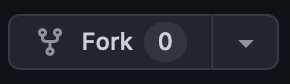
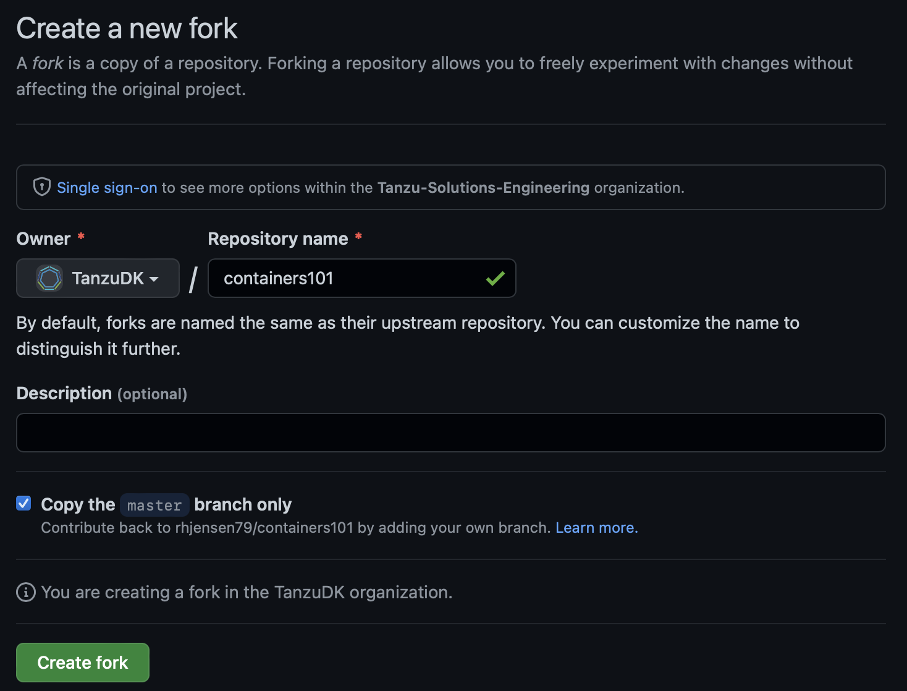

# Start

This is the manual, for the [Github repository Containers 101](https://github.com/rhjensen79/containers101)

## Getting Started

To get started, using the training, you first need to login to your Github account, and open this [repository](https://github.com/rhjensen79/containers101)

To get your own copy, you need to fork it.
Forking means, that you take a copy, of the repo, and save it under your own name.
This means that all changes, are your own, and does not affect the "original" repository.

- Start by pressing the Fork button, in the top right corner, in the repository.

- Then save it under your own username/reponame


## Intro

### What is a container

### Installing Docker

## First Container

## Dockerfile

## Registrys

## Docker-Compose

## Trubleshooting

## Volumes

## Kubernetes

## Sample

One more, finally. Or not? :)

Now:

```
some
```

Look what she said:

> This is it!

### Subtitle

And now this:

- One
- Two
- Three
- four

#### As well

#### As this

### Another

[a link](https://aws.com)

More?

Can we now have `the build`?

NOW!

Not gonna work, is it?
