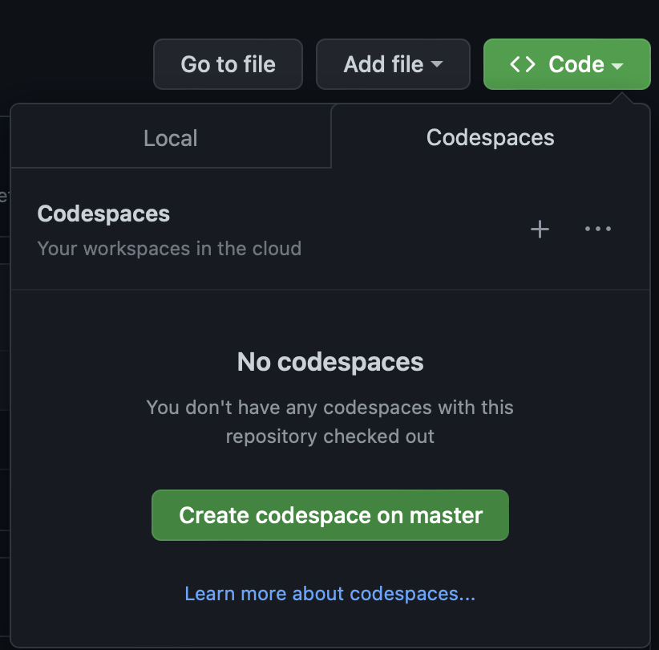

# Start

## Welcome

This is the manual, for the [Github repository Containers 101](https://github.com/rhjensen79/containers101)
The purpose of this training, is to provide you with an enviroment, where you can learn the basics of containers.
When you are done, you should have the skills, to go out and create your own containers, deploy them, and harwest some of the benefits, containers provide.

Happy learning :-)

## Getting Started

To get started with the training, you first need to login to your Github account, and open the  repository [github.com/rhjensen79/containers101](https://github.com/rhjensen79/containers101)

To get your own copy, you need to fork it.
Forking means, that you take a copy, of the repo, and save it under your own name.
This means that all changes, are your own, and does not affect the "original" repository.

- Start by pressing the Fork button, in the top right corner, in the repository page.

- Then save it under your own username/reponame

You can keep the checkmark in "Copy the master branch only" since that is the only branch you will need.

- Click the green "Code" button, and select the "Codespaces" tab, and click "Create Codespace on master"

If you have vscode installed, it might ask you "Do you want to allow this page to open “Visual Studio Code”?". If you want to use your local vscode client, then just say allow.

After some time, your browser or vscode (depending on your choice) will open, with an enviroment, with all the files, ready for you to use.

You are now ready to proceed to the next step.
